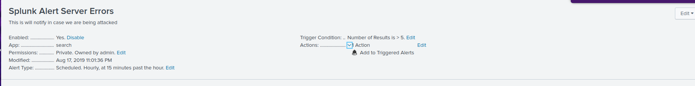
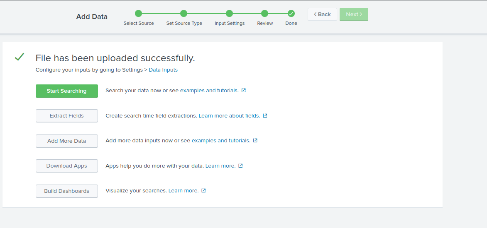
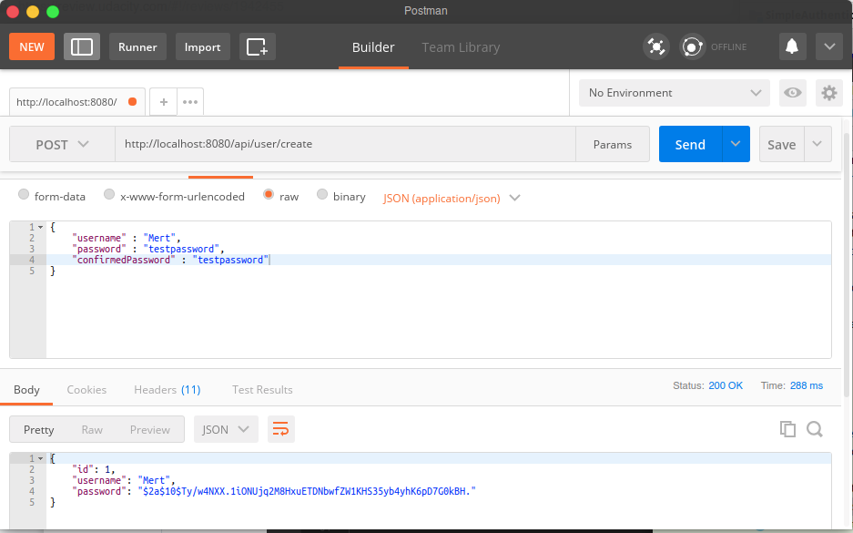
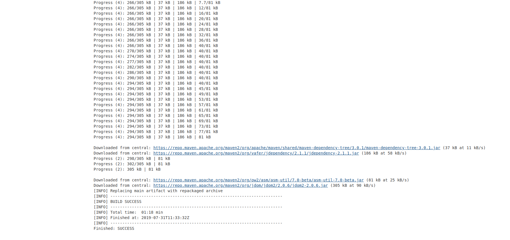
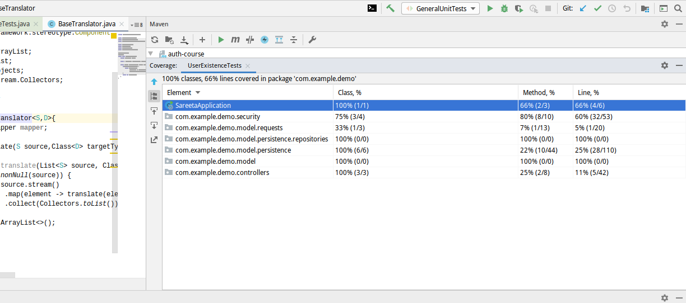

# eCommerce Application

### Setting Up the Alerts
I included logs inside my code in order to trace and I also set up alerts. The alert is there to signal when a particular query is made. Below is a screen capture to illustrate this.


Also I indexed logs into splunk , below is a capture of the successful uploads of the log files.
 

### DashBoard
below is a vizualisation of the createUser sucesstime per minute.


### Password Validation
The code was updated in orer to satisfy the rubrics for the password validation and confirmed password too, below is a screen capture to show this



### Proper Branching
This is a link to the github repo of the project with proper branching and all the commits have been inserted.

`https://github.com/Mert-Can/JDND`

### build

- link to successful build can be found at `http://ec2-13-229-198-115.ap-southeast-1.compute.amazonaws.com:8080/job/eCommerce/5/console
`
### Code Coverage

The target test coverage has been attained and the results are depicted in the picture below
Please remember that I have two broad testing modules they both sum up to meet the target


### Email Notification
Below are are two pictures of how I set up my email notification on jenkins


### Monitoring the System
Below is a picture of the systems I used in monitoring  the product
I deployed the eCommerce app on AWS


### JWT Authentification

In the picture below you can see how I succesfully generated jwt tokens from the user name and password


### Deployment
The eCommerce app is both present on Jenkins and is also deployed on AWS , it is downloadable from the link 
`https://ecommerce123.s3-ap-southeast-1.amazonaws.com/auth-course-0.0.1-SNAPSHOT.jar`

```
curl -H "Content-Type: application/json" -X POST -d '{
     "username": "admin",
     "password": "password"
 }' http://localhost:8080/api/users/create
```

```
curl -i -H "Content-Type: application/json" -X POST -d '{
    "username": "admin",
    "password": "password"
}' http://localhost:8080/login

```
### Demo Video
In this file the is an mp4 file `eCommerce_Demo.mp4` that is required in this project that I made where I tests all my security implementations. And also I test most of my different endpoints.
